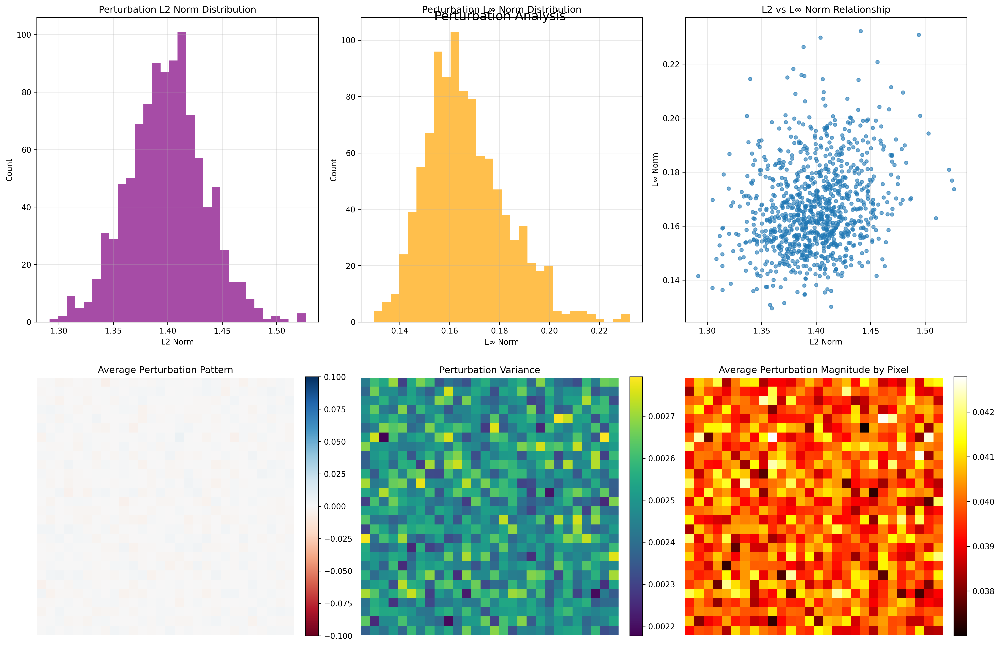

# Subset Scanning Adversarial Detection Demo

A comprehensive demonstration of **subset scanning for adversarial detection** using the Adversarial Robustness Toolbox (ART). This project showcases how subset scanning can effectively identify adversarial examples hidden within clean data.

## 🎯 Overview

This demo implements the complete workflow for detecting adversarial examples using subset scanning:

1. **FGSM Attack Generation**: Create adversarial examples using Fast Gradient Sign Method
2. **Mixed Dataset Creation**: Hide adversarial samples within clean data (simulating real-world scenarios)
3. **Subset Scanning Detection**: Use ART's `SubsetScanningDetector` to identify the anomalous subgroup
4. **Performance Evaluation**: Comprehensive metrics and visualizations
5. **Qualitative Analysis**: Visual evidence of subtle perturbations and detection results

## 🖼️ Visual Showcase

Here are some key visualizations from the demo:

### Original vs Adversarial Images


*Shows the subtle differences between clean and adversarial images, with perturbation patterns and magnified views.*

### Detection Performance


*Demonstrates how well the subset scanning detector separates clean from adversarial samples.*

### Perturbation Patterns


*Reveals systematic patterns in adversarial attacks and identifies vulnerable image regions.*

## 🚀 Quick Start

### Prerequisites

```bash
# Create virtual environment
python -m venv venv
source venv/bin/activate  # On Windows: venv\Scripts\activate

# Install dependencies
pip install -r requirements.txt
```

### Run the Complete Showcase

```bash
# Train the model first (if not already trained)
python src/models/cnn_model.py

# Run the comprehensive showcase
python showcase_subset_scanning_demo.py
```

This will demonstrate the complete workflow and generate both quantitative and qualitative visualizations.

### Interactive Visualization App

For a standalone interactive visualization experience:

```bash
# Run the interactive visualization app
python visualization_app.py
```

This app will:
- Load real data if available, or create realistic dummy data
- Display interactive visualizations one by one
- Save visualizations to files
- Provide detailed explanations for each visualization

Each visualization opens in a separate window - close it to proceed to the next one.

### Screenshot Demo

For creating high-resolution screenshots for documentation or presentations:

```bash
# Create high-resolution screenshots
python screenshot_demo.py
```

This will generate publication-ready screenshots in the `screenshots/` directory.

### Visualization Guide

For detailed information about all visualization features, customization options, and troubleshooting, see the comprehensive [Visualization Guide](VISUALIZATION_GUIDE.md).

## 📊 What You'll See

The showcase demonstrates:

- **FGSM Attack Effectiveness**: Shows how adversarial examples can fool the model
- **Hidden Adversarial Detection**: Subset scanning finds adversarial samples even when they're mixed with clean data
- **Performance Comparison**: Raw pixels vs. feature-based detection
- **Comprehensive Metrics**: ROC AUC, precision, recall, F1-score
- **Quantitative Visualizations**: Score distributions, ROC curves, confusion matrices
- **Qualitative Visualizations**: Original vs adversarial images, perturbation patterns, detected anomalies (see screenshots above)
- **Interactive Exploration**: Each visualization opens in a separate window for detailed examination

## 🏗️ Project Structure

```
├── showcase_subset_scanning_demo.py  # Main showcase script
├── visualization_app.py              # Standalone interactive visualization app
├── screenshot_demo.py                # High-resolution screenshot generator
├── src/
│   ├── data/
│   │   ├── dataset.py              # MNIST data loading
│   │   └── subset_data.py          # Mixed dataset preparation
│   ├── models/
│   │   └── cnn_model.py            # CNN model for MNIST
│   ├── attacks/
│   │   └── fgsm_attack.py          # FGSM attack implementation
│   ├── scanning/
│   │   ├── art_subset_scanner.py   # ART subset scanning utilities
│   │   ├── subset_evaluation.py    # Evaluation and visualization
│   │   ├── simple_subset_scanning_demo.py  # Simple demo
│   │   └── run_subset_scanning_demo.py     # Comprehensive demo
│   ├── visualization/
│   │   ├── qualitative_analysis.py # Qualitative visualizations
│   │   └── __init__.py
│   └── utils/
│       ├── art_utils.py            # ART classifier utilities
│       └── data_utils.py           # Data preparation utilities
├── screenshots/                     # High-resolution visualization screenshots
├── interactive_visualizations/      # Interactive visualization outputs
├── VISUALIZATION_GUIDE.md          # Comprehensive visualization guide
└── requirements.txt
```

## 🔬 Key Features

### 1. FGSM Attack Integration
- Uses ART's `FastGradientMethod` for generating adversarial examples
- Configurable perturbation magnitude (ε)
- Attack effectiveness evaluation

### 2. Subset Scanning Detection
- **Raw Pixel Detection**: Flattened image data (784 dimensions for MNIST)
- **Feature-Based Detection**: Extracted features from CNN layers
- **Mixed Dataset Support**: Hidden adversarial samples within clean data

### 3. Comprehensive Evaluation
- ROC curves and AUC scores
- Precision-recall analysis
- Confusion matrices
- Score distribution visualization

### 4. Qualitative Visualization
- **Original vs Adversarial**: Side-by-side comparison showing subtle perturbations
- **Perturbation Analysis**: Statistical analysis of perturbation patterns
- **Detected Anomalies**: Visualization of images identified as anomalous
- **Score Distribution**: Analysis of detection scores across clean and adversarial samples

### 5. ART Integration
- Seamless integration with ART's `SubsetScanningDetector`
- PyTorch model compatibility
- Configurable detection parameters

## 📈 Example Results

When you run the showcase, you'll see output like:

```
SUBSET SCANNING ADVERSARIAL DETECTION SHOWCASE
================================================================================

PHASE 1: Loading Data and Model
----------------------------------------
✓ Loaded 1000 test samples
✓ Data shape: torch.Size([1000, 1, 28, 28])
✓ Model accuracy on clean data: 98.50%

PHASE 2: Generating FGSM Adversarial Examples
----------------------------------------
✓ FGSM attack completed with eps=0.3
✓ Attack success rate: 85.20%
✓ Adversarial accuracy: 14.80%

PHASE 3: Creating Mixed Dataset with Hidden Adversarial Subgroup
----------------------------------------
✓ Mixed dataset created:
  - Total samples: 1000
  - Clean samples: 900
  - Adversarial samples: 100
  - Contamination rate: 10.0%

PHASE 4: Running Subset Scanning Detection
----------------------------------------
✓ Raw pixel detection completed!
✓ Feature-based detection completed!

PHASE 5: Evaluation and Visualization
----------------------------------------
DETECTION PERFORMANCE COMPARISON
============================================================
Metric               Raw Pixels      Features        
------------------------------------------------------------
ROC AUC              0.892           0.945           
PR AUC               0.756           0.823           
F1 Score             0.723           0.789           
Precision            0.689           0.756           
Recall               0.760           0.823           

PHASE 6: Qualitative Visualization
----------------------------------------
✓ Original vs adversarial visualization saved
✓ Detection scores distribution saved
✓ Detected anomalies visualization saved
✓ Perturbation analysis saved

🎯 SUCCESS: Subset scanning successfully detected the hidden adversarial subgroup!
```

## 🖼️ Qualitative Visualizations

The showcase generates several qualitative visualizations that provide intuitive understanding:

### Interactive Display
All visualizations are displayed interactively in separate windows, allowing you to:
- **Zoom and pan** to examine details
- **Save screenshots** using the plot window controls
- **Explore different aspects** of the visualizations
- **Close windows** to proceed to the next visualization

### 1. Original vs Adversarial Images
- **Side-by-side comparison** of clean and perturbed images
- **Perturbation visualization** showing the subtle differences
- **Magnified perturbations** to highlight imperceptible changes
- **Perturbation statistics** (L∞ and L2 norms)

*See the Visual Showcase section above for an example of this visualization.*

### 2. Detection Score Analysis
- **Score distributions** for clean vs adversarial samples
- **Box plots and violin plots** showing separation
- **ROC curves** demonstrating detection performance

*See the Visual Showcase section above for an example of this analysis.*

### 3. Detected Anomalies
- **True positives**: Adversarial images correctly detected
- **False positives**: Clean images incorrectly flagged
- **Score rankings**: Top detected anomalies
- **Threshold analysis**: Detection boundary visualization

### 4. Perturbation Analysis
- **Statistical patterns** across the dataset
- **Average perturbation patterns** showing systematic changes
- **Perturbation variance** highlighting consistent vs random changes
- **Pixel-level analysis** of where perturbations occur most

*See the Visual Showcase section above for an example of this analysis.*

## 🛠️ Usage Examples

### Basic Demo
```python
from src.scanning.simple_subset_scanning_demo import main
main()
```

### Comprehensive Demo
```python
from src.scanning.run_subset_scanning_demo import main
main()
```

### Custom FGSM Attack
```python
from src.attacks.fgsm_attack import generate_fgsm_attack
adv_data, adv_preds, success_rate = generate_fgsm_attack(
    model, test_data, test_labels, eps=0.3
)
```

### Subset Scanning Detection
```python
from art.defences.detector.evasion import SubsetScanningDetector
from src.utils.art_utils import create_art_classifier

classifier = create_art_classifier(model)
detector = SubsetScanningDetector(classifier, window_size=784)
scores, p_values, scan_stats = detector.detect(x_combined_flat)
```

### Qualitative Visualization
```python
from src.visualization.qualitative_analysis import create_comprehensive_qualitative_analysis

create_comprehensive_qualitative_analysis(
    clean_data, adversarial_data, true_labels, adv_predictions, 
    scores, y_true, output_dir='my_visualizations'
)
```

## 📚 Technical Details

### Subset Scanning Algorithm
- **Statistical Approach**: Uses likelihood ratio tests to identify anomalous subgroups
- **Unsupervised Detection**: No labels required during detection
- **Scalable**: Efficient implementation for large datasets

### ART Integration
- **PyTorchClassifier**: Wrapper for PyTorch models
- **SubsetScanningDetector**: Main detection class
- **Configurable Parameters**: Window size, scoring functions, etc.

### Evaluation Metrics
- **ROC AUC**: Area under the receiver operating characteristic curve
- **PR AUC**: Area under the precision-recall curve
- **F1 Score**: Harmonic mean of precision and recall
- **Confusion Matrix**: Detailed classification results

### Visualization Features
- **Multi-panel layouts**: Comprehensive analysis in single figures
- **Color-coded results**: Intuitive distinction between clean and adversarial
- **Statistical overlays**: Thresholds, confidence intervals, and distributions
- **High-resolution output**: Publication-ready visualizations

## 🤝 Contributing

This project demonstrates the integration of subset scanning with ART. Contributions are welcome!

## 📄 License

This project is licensed under the MIT License - see the LICENSE file for details.

## 🙏 Acknowledgments

- **ART Team**: For the Adversarial Robustness Toolbox
- **Subset Scanning Research**: For the statistical foundation
- **MNIST Dataset**: For the standard benchmark dataset

## Contact

For questions and support, please open an issue on GitHub or contact the maintainers.

---

**Note**: This is a demonstration project. For production use, please ensure proper testing and validation of all algorithms and implementations. 